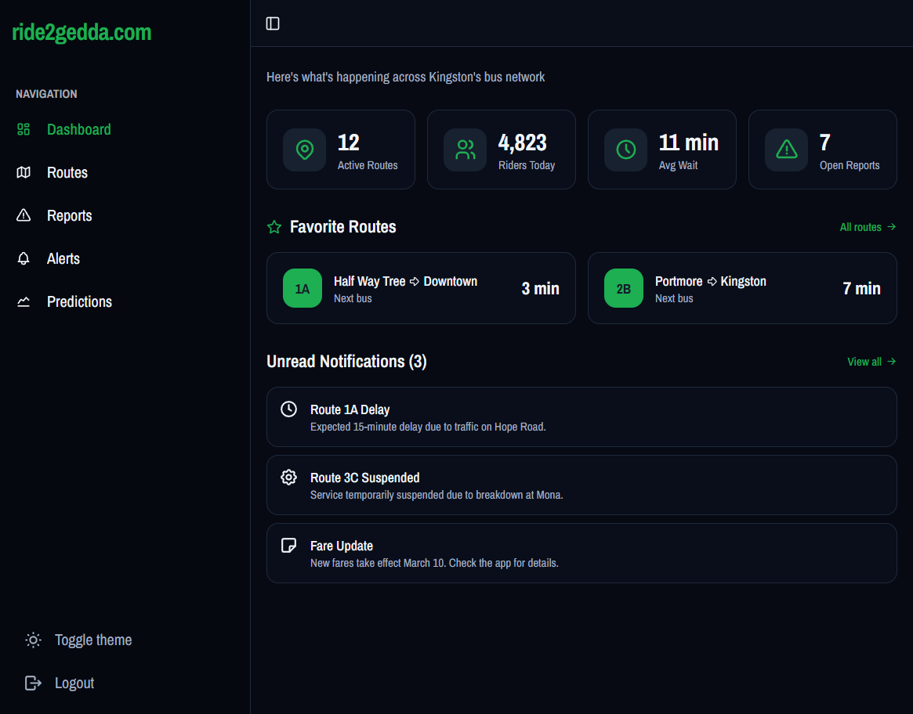
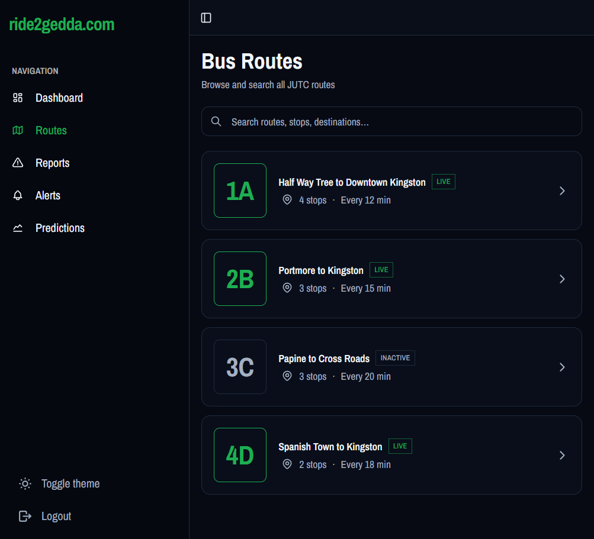
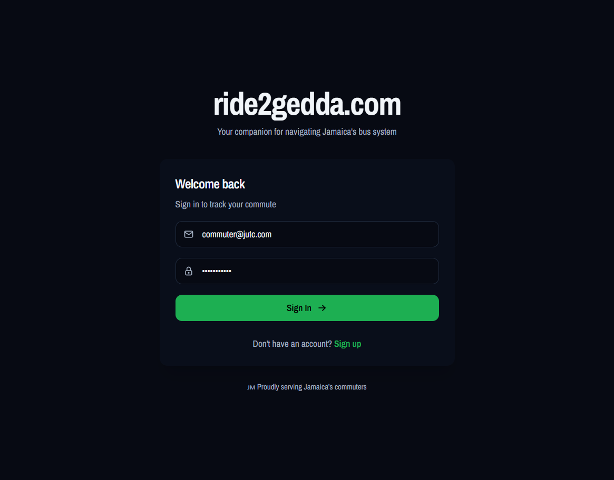

# Ride2Gedda

A community-driven Jamaican bus commute app that helps riders plan and navigate JUTC bus journeys more confidently using official schedules, community reports, and AI-assisted predictions.

---

## Preview

<p align="center">
  
</p>

<p align="center">
  
</p>

<p align="center">
  
</p>

---

## Features

- **Smart dashboard** for monitoring key commute insights at a glance
- **Route explorer** with detailed route and stop information
- **AI-powered predictions** for demand and peak periods
- **Community reports** for delays, breakdowns, overcrowding, and route changes
- **Notifications** for important service updates
- **Light/dark theme** with a modern, accessible UI

---

## Project Structure

This repository is organized as a full-stack project:

- **frontend/** – Vite + React + TypeScript + Tailwind CSS app
- **backend/** – Server-side APIs and services (implementation TBD / in progress)

---

## Getting Started

### Prerequisites

- Node.js (LTS recommended)
- npm or pnpm/yarn

### Frontend

```bash
cd frontend
npm install
npm run dev
```

The app will start on the local development port shown in the terminal (typically http://localhost:5173).

### Backend

Backend setup and APIs are still being designed. This section can be expanded once the backend is implemented.

---

## Contributing

Contributions, ideas, and feedback are welcome. If you would like to contribute:

1. Fork the repository
2. Create a feature branch
3. Open a pull request with a clear description of your changes

---

## License

This project is currently unpublished under a specific license. Please contact the repository owner before using it in production or commercial contexts.
